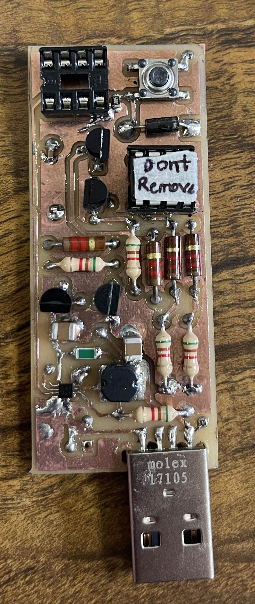
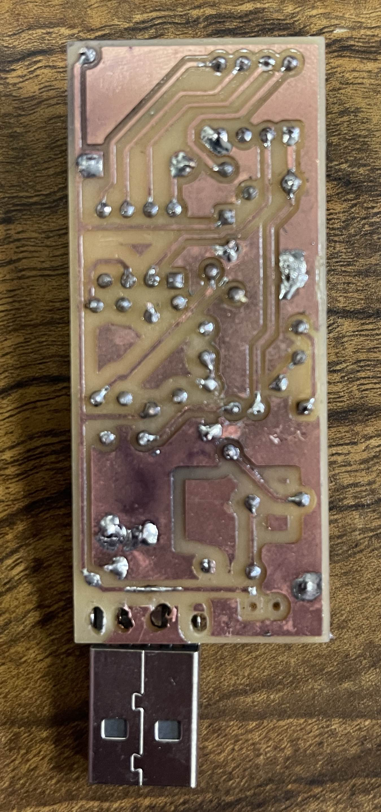
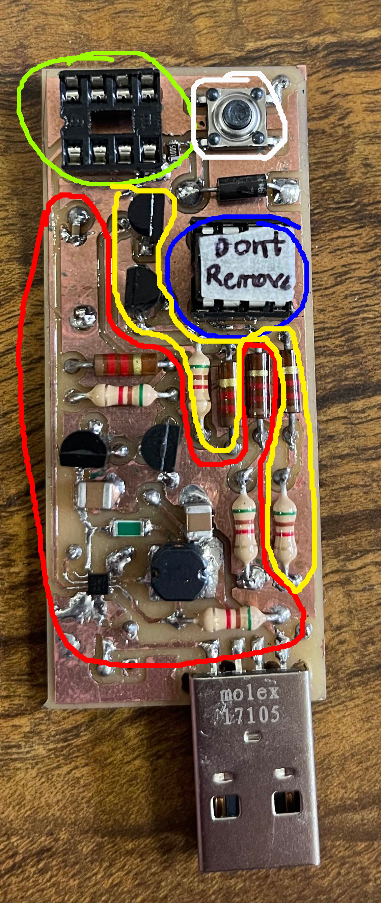

### ATtiny85 HVSP for reset-locked device recovery (hand solderable)

> this hardware can be used on some chips of the same family after slight modification.

uses one ATTiny85 to recover other reset-locked ATtiny85's. Done by bringing the target ATtiny85 into HVSP mode, to reprogram the high fuse bits to `0xDF`.

[schematic view pdf](./demo/top%20level.pdf)

### Details
- Kicad 8.0
- master ATTiny85 operates at 8MHz(optional) with reset pin set to act as GPIO(required).
- made from common components. notable exceptions listed.
    - the [MIC2290](https://ww1.microchip.com/downloads/en/DeviceDoc/MIC2290.pdf) (boost converter IC to supply 12V; ~$1.00 for a order of 1 from Digikey), **this can be substituted** with a 12V supply tapped to the same trace.
    - the USB connector **can be substituted** with a 5V supply tapped to the same trace.

---

| Count | Component |
|-|-|
| 1 | MIC2290 boost converter IC |
| 1 | USB A plug |
| 1 | single pole switch (optional) |
| 1 | ATtiny85 |
| 1 | 44.2k Ohm |
| 5 | 5k Ohm |
| 4 | 1.2k ohm
| 1 | 10uH |
| 1 | 100nF |
| 2 | 10uF |
| 1 | diode (optional) |
| 2 | NPN BJT |
| 2 | PNP BJT |

---

  
    

As shown, empty DIP socket holds target; master has a "dont remove" sticker. 100nF disk has been subsuited with a same sized SMD. 20k ohm pull down added on the buttons low side because the exact button used acts as a ~2M ohm resistor in its off state. Extra solder points because my maufacturing does not support plated vias, manually 'plating' was needed.

---

    
    

        <h3>Coloring</h3>
        <ul>
            <li>Green: reset-locked chip goes here</li>
            <li>White: go button</li>
            <li>Blue: master chip goes here</li>
            <li>red: 12V control circuitry</li>
            <li>yellow: 5V control circuitry</li>
        </ul>
        <h3>Setup</h3>
        <ol>
            <li>fab & assemble board</li>
            <li>program a master ATtiny85 using the code from the 'code' sub folder of this project. note that master ATtiny85 uses its reset pin as GPIO so the approate fuse bit needs set.</li>
            <li>put master in the blue outlined socket; notch to the left.</li>
        </ol>
        <h3>Operation</h3>
        <ol>
            <li>put reset-locked ATtiny85 in the green indicated socket; notch to the left.</li>
            <li>press & hold button for ~0.5 seconds</li>
            <li>target chip is now unbricked!</li>
        </ol>
    

